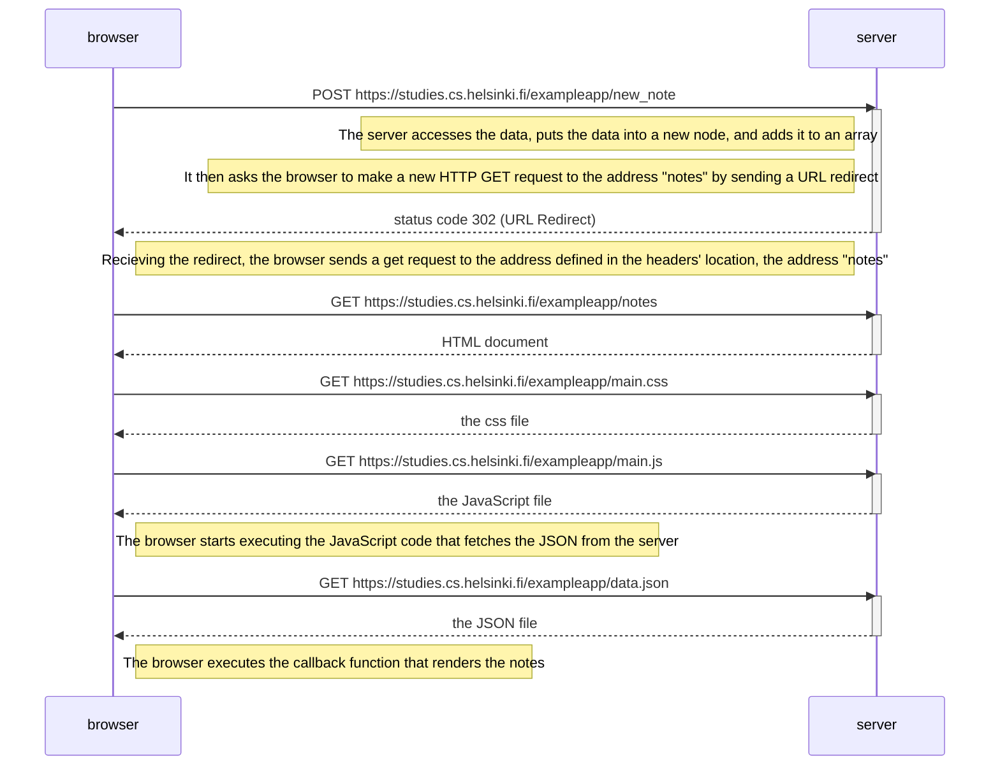

```mermaid
    sequenceDiagram
    participant browser
    participant server

    browser->>server: POST https://studies.cs.helsinki.fi/exampleapp/new_note
    activate server

    Note left of server: The server accesses the data, puts the data into a new node, and adds it to an array
    Note left of server: It then asks the browser to make a new HTTP GET request to the address "notes" by sending a URL redirect

    server-->>browser: status code 302 (URL Redirect)
    deactivate server

    Note right of browser: Recieving the redirect, the browser sends a get request to the address defined in the headers' location, the address "notes"

    browser->>server: GET https://studies.cs.helsinki.fi/exampleapp/notes
    activate server
    server-->>browser: HTML document
    deactivate server

    browser->>server: GET https://studies.cs.helsinki.fi/exampleapp/main.css
    activate server
    server-->>browser: the css file
    deactivate server

    browser->>server: GET https://studies.cs.helsinki.fi/exampleapp/main.js
    activate server
    server-->>browser: the JavaScript file
    deactivate server

    Note right of browser: The browser starts executing the JavaScript code that fetches the JSON from the server

    browser->>server: GET https://studies.cs.helsinki.fi/exampleapp/data.json
    activate server
    server-->>browser: the JSON file
    deactivate server

    Note right of browser: The browser executes the callback function that renders the notes
```
