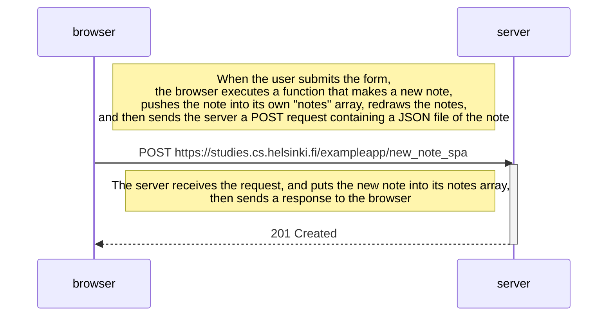

```mermaid
    sequenceDiagram
    participant browser
    participant server

    Note right of browser: When the user submits the form,<br/>the browser executes a function that makes a new note,<br/>pushes the note into its own "notes" array, redraws the notes,<br/>and then sends the server a POST request containing a JSON file of the note

    browser->>server: POST https://studies.cs.helsinki.fi/exampleapp/new_note_spa
    activate server

    Note left of server: The server receives the request, and puts the new note into its notes array,<br/>then sends a response to the browser

    server-->>browser: 201 Created
    deactivate server
```
